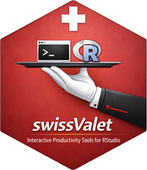

# 📦 swissValet 

<!-- badges: start -->
[](https://CRAN.R-project.org/package=swissValet)
[](https://www.gnu.org/licenses/old-licenses/gpl-2.0.html)
<!-- badges: end -->

**Title:** Interactive Functions to be Used as Shortcuts in RStudio\
**License:** GPL (≥ 2)

## 🧩 Overview

`swissValet` turns the inspection functions you type dozens of times a
day into single keystrokes. Each addin takes the current selection in the
RStudio editor, wraps it in the corresponding call and executes it
immediately in the console.

Select `mtcars`, press your shortcut, and `str(mtcars)` runs — no
copying, no typing, no losing the selection.

The package further contains interactive dialogs for selecting variables
and sorting code elements, converters between Unicode characters and
escape sequences, and a routine that writes an existing object back into
the editor as reproducible source code.

📖 **Repository:** <https://github.com/AndriSignorell/swissValet/>

## ⚙️ Installation

``` r
install.packages("swissValet")
```

Or the development version from GitHub:

``` r
remotes::install_github("AndriSignorell/swissValet")
```

## ⌨️ Setting up shortcuts

In RStudio: **Tools → Modify Keyboard Shortcuts…**, filter for the addin
name, and assign a key combination. A layout that keeps the fingers in
one place works well, for example `Ctrl+Alt+S` for `xStrX`, `Ctrl+Alt+H`
for `xHead`, `Ctrl+Alt+P` for `xPlot`.

## 📚 Core Features

### 🔹 Inspection Addins

Each applies its function to the current editor selection:

| Addin | Runs |
|---|---|
| `xStrX()` | `strX()` — structure of the object |
| `xSummary()` | `summary()` |
| `xHead()` | `head()` |
| `xDesc()` | `desc()` |
| `xAbstract()` | `abstract()` |
| `xExample()` | `example()` |
| `xPlot()` | `plot()` |
| `xUnclass()` | `unclass()` |
| `xxlView()` | `xlView()` — open in Excel |

### 🔹 Interactive Dialogs

-   `selectVarDlg()` — pick elements, factor levels or data frame
    columns from a list and get the corresponding R expression, copied
    to the clipboard
-   `.orderSelectionDlg()` — choose ascending, descending or random
    ordering for selected code elements

### 🔹 Editor Utilities

-   `flushToSource()` — write the selected object back into the document
    as reproducible code; data frames become a readable `data.frame(...)`
    call rather than `dput()` output
-   `toggleUnicodeAddin()` — convert the selection between Unicode
    characters and escape sequences

### 🔹 Helpers

-   `some()` — a random subset of a vector, matrix or data frame, the
    counterpart to `head()` and `tail()`
-   `escapeUnicode()`, `unescapeUnicode()`

## 🧪 Example

``` r
library(swissValet)

# a random subset instead of the first rows
some(mtcars, 5)
some(letters, 10)

# n relative to the object size
some(1:20, -5)

# Unicode round trip
escapeUnicode("Schneehöhe")
unescapeUnicode("Schneeh\\u00f6he")
```

## 🧱 The Suite

`swissValet` uses `bedrock`, `pharos`, `DescToolsX` and `pons` for the
functions its addins call.

## 🙏 Acknowledgements

Parts of the code and documentation were reviewed with the help of large
language models (OpenAI Codex, Anthropic Claude). Every suggestion was
assessed, edited and verified by the maintainer, who remains solely
responsible for the content of this package.

## 📜 License

GPL (≥ 2)
